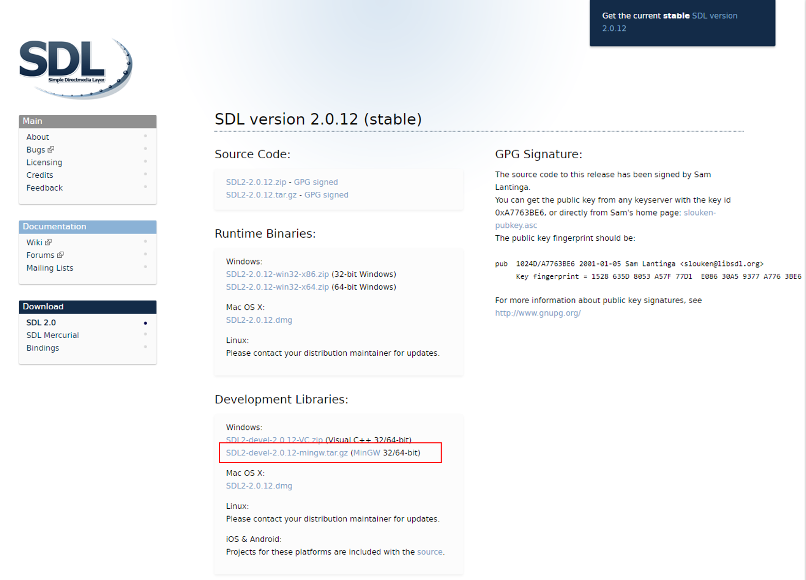

# SDL2_Installtion
The following step is how I install SDL2 in my windows 10 computer

## Dependency
* cmake >= 3.7
* [MinGW](http://www.mingw.org/) or [Mingw64](http://mingw-w64.org/doku.php)
  here used Mingw64
  
## Step
 1. download [SDL](https://www.libsdl.org/download-2.0.php)
 
