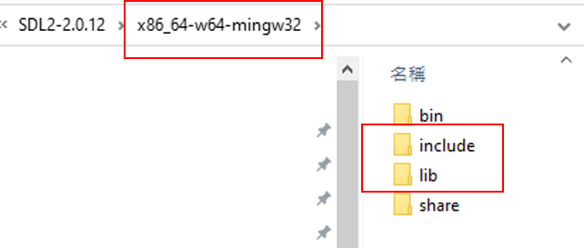
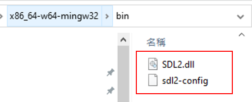
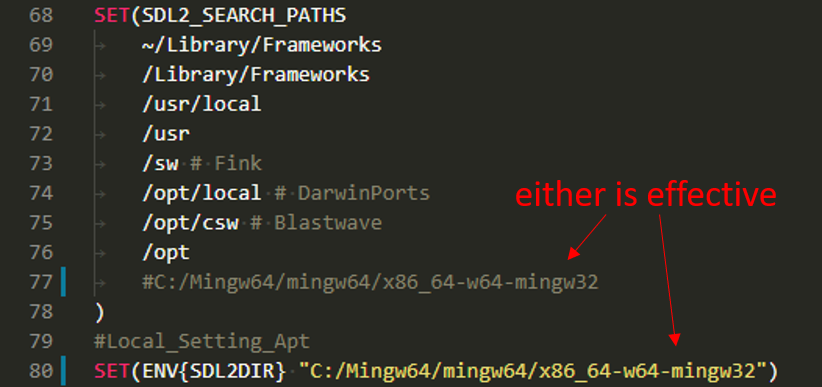

# SDL2_Installtion
The following step is how I install SDL2 on my windows 10 computer

Detailed steps please refer to this great Youtube video.
https://www.youtube.com/watch?v=7sIBklOTImI

## Dependency
* cmake >= 3.7
* [MinGW](http://www.mingw.org/) or [Mingw64](http://mingw-w64.org/doku.php)
  here used Mingw64
  
## Step
1. download [SDL](https://www.libsdl.org/download-2.0.php)
 
2. Find folder: x86_64-w64-mingw32 where your mingw was installed
 
3. unzip folder and find the folder with the same name: x86_64-w64-mingw32
    copy sub-folders: include and lib to your mingw installation folder as shown above in step 2
 
4. copy these files into C:\Windows\System32
 
5. add SDL paht to FindSDL2.cmake
 

 ## Basiv Build Instructions
1. Clone this repo.
2. Make a build directory in the top level directory: `mkdir build && cd build`
3. Compile: `cmake .. && make`
4. Run it: `./SDL2_Test`.
